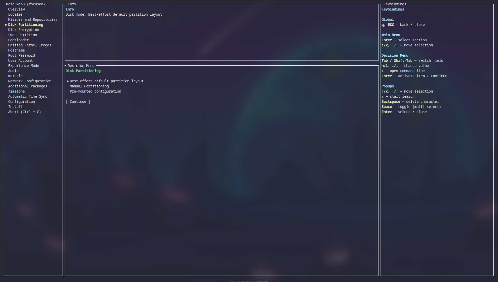

# 🦀 archinstall-rs

A modern, intuitive TUI (Terminal User Interface) installer for Arch Linux written in Rust. This project aims to simplify the Arch Linux installation process while maintaining the flexibility and control that Arch users expect.



## ✨ Features

- **🖥️ Modern TUI Interface**: Built with [ratatui](https://github.com/ratatui-org/ratatui), providing an intuitive and responsive terminal interface
- **⚡ Fast & Efficient**: Written in Rust for optimal performance and memory safety
- **🔧 Flexible Configuration**: Support for various installation scenarios and customization options
- **💾 Configuration Saving**: Save and load installation configurations in TOML format
- **🔐 Disk Encryption**: Support for LUKS encryption with multiple encryption types
- **🌍 Localization**: Comprehensive locale, timezone, and keyboard layout configuration
- **📦 Package Management**: Configure mirrors, optional repositories, and additional packages
- **👤 User Management**: Create users with sudo privileges and secure password handling
- **🔄 Multiple Bootloaders**: Support for systemd-boot, GRUB, and other bootloaders
- **🎵 Audio System Selection**: Choose between different audio subsystems
- **🔗 Network Configuration**: Configure network settings for your installation
- **⚙️ Kernel Selection**: Choose from various kernel options
- **💱 Swap Configuration**: Optional swap partition setup

## 📋 Requirements

### Build Requirements
- Rust 1.70 or later (2024 edition)
- Cargo package manager

### Runtime Requirements
- Arch Linux live environment (USB/ISO)
- UEFI or BIOS system
- Internet connection for package downloads
- Minimum 512MB RAM (1GB+ recommended)
- Minimum 2GB disk space (20GB+ recommended for comfortable usage)

## 🚀 Installation

### From Source

```bash
# Clone the repository
git clone https://github.com/yourusername/archinstall-rs.git
cd archinstall-rs

# Build the project
cargo build

# Run the installer
cargo run
```

### Pre-built Binary

*(Coming soon)*

```bash
# Download the latest release
wget https://github.com/yourusername/archinstall-rs/releases/latest/download/archinstall-rs
chmod +x archinstall-rs

# Run the installer
./archinstall-rs
```

## 🎮 Usage

### Basic Installation

1. Boot into Arch Linux live environment
2. Ensure you have an internet connection
3. Run the installer:
   ```bash
   ./archinstall-rs
   ```
4. Navigate through the installation sections using arrow keys
5. Configure each section according to your preferences
6. Review your configuration
7. Start the installation

### Navigation

| Key | Action |
|-----|--------|
| `↑/↓` | Navigate menu items |
| `←/→` | Switch between menu and content |
| `Enter` | Select/Confirm |
| `Esc` | Back/Cancel |
| `Tab` | Switch focus |
| `Space` | Toggle selection (in multi-select lists) |
| `q` | Quit (with confirmation) |

### Configuration Sections

#### 1. **Locales**
- Keyboard layout selection
- System language configuration  
- Character encoding settings

#### 2. **Mirrors & Repositories**
- Mirror region selection
- Optional repository configuration (multilib, testing, etc.)
- Custom repository management
- Custom mirror server configuration

#### 3. **Disks**
- Automatic partitioning with best-effort layout
- Manual partition selection
- File system configuration

#### 4. **Disk Encryption**
- LUKS encryption support
- Password-based encryption
- Partition-specific encryption

#### 5. **Swap Partition**
- Enable/disable swap
- Automatic swap size calculation
- Custom swap configuration

#### 6. **Bootloader**
- systemd-boot (recommended for UEFI)
- GRUB (UEFI/BIOS support)
- Other bootloader options

#### 7. **Unified Kernel Images**
- Configure unified kernel image generation
- Secure boot preparation

#### 8. **System Configuration**
- Hostname configuration
- Root password setup
- User account creation
- Sudo privileges management

#### 9. **Experience Mode**
- Desktop environment selection
- Display manager configuration
- Basic package sets

#### 10. **Audio**
- PulseAudio
- PipeWire
- ALSA only
- No audio

#### 11. **Kernels**
- linux (stable)
- linux-lts (long-term support)
- linux-hardened (security-focused)
- linux-zen (performance-focused)

#### 12. **Network Configuration**
- NetworkManager
- systemd-networkd
- Manual configuration

#### 13. **Additional Packages**
- Custom package installation
- AUR helper installation

#### 14. **Timezone & Time Sync**
- Timezone selection
- NTP configuration

## ⚙️ Configuration File

The installer supports saving and loading configurations in TOML format. This allows for:
- Reproducible installations
- Configuration sharing
- Automated deployments

### Example Configuration

```toml
[locales]
keyboard_layout = "us"
locale_language = "en_US"
locale_encoding = "UTF-8"

[mirrors]
regions = ["United States", "Canada"]
optional_repos = ["multilib", "multilib-testing"]
custom_servers = []
custom_repos = []

[disks]
mode = "Best-effort default partition layout"

[disk_encryption]
encryption_type = "None"

[swap]
enabled = true

[bootloader]
kind = "systemd-boot"

[[users]]
username = "myuser"
password_hash = "..." # SHA256 hash
is_sudo = true

[hostname]
name = "archlinux"

[experience]
mode = "Desktop"
desktop_environment = "KDE Plasma"

[audio]
system = "pipewire"

[kernels]
selected = ["linux", "linux-lts"]

[network]
configuration = "NetworkManager"

[packages]
additional = ["firefox", "neovim", "git"]

[timezone]
region = "America"
city = "New_York"

[time_sync]
ntp_enabled = true
```

### Loading a Configuration

```bash
# Load from default location
./archinstall-rs --config archinstall-rs.config.toml

# Load from custom location
./archinstall-rs --config /path/to/config.toml
```

## 🏗️ Project Structure

```
archinstall-rs/
├── src/
│   ├── main.rs              # Entry point
│   └── ui/
│       ├── mod.rs           # UI module root
│       ├── app.rs           # Application state and logic
│       ├── render.rs        # Rendering logic
│       ├── input.rs         # Input handling
│       └── app/             # Individual installation sections
│           ├── config.rs
│           ├── disks.rs
│           ├── locales.rs
│           ├── mirrors.rs
│           ├── disk_encryption.rs
│           ├── swap_partition.rs
│           ├── bootloader.rs
│           ├── unified_kernel_images.rs
│           ├── hostname.rs
│           ├── root_password.rs
│           ├── user_account.rs
│           ├── experience_mode.rs
│           ├── audio.rs
│           ├── kernels.rs
│           ├── network_configuration.rs
│           ├── additional_packages.rs
│           ├── timezone.rs
│           ├── automatic_time_sync.rs
│           ├── save_configuration.rs
│           ├── install.rs
│           └── abort.rs
├── archinstall-rs.config.toml  # Example configuration
├── Cargo.toml                   # Rust dependencies
└── README.md                    # This file
```

## 🔧 Development

### Building from Source

```bash
# Debug build (faster compilation)
cargo build

# Run with debug build
cargo run

# Check for compilation errors
cargo check

# Run tests
cargo test

# Format code
cargo fmt

# Lint code
cargo clippy
```

### Architecture Principles

- **Modularity**: Each installation section is a separate module
- **Separation of Concerns**: UI, logic, and data are clearly separated
- **Type Safety**: Leverage Rust's type system for reliability
- **Error Handling**: Graceful error handling with user-friendly messages

### Adding New Features

1. Create a new module in `src/ui/app/`
2. Define the UI components and state
3. Add the section to the main menu in `app.rs`
4. Update the configuration structure if needed
5. Add tests for the new functionality

## 🚦 Roadmap

- [ ] **v0.2.0** - Manual Partitioning
  - [ ] Advanced partition editor
  - [ ] Custom mount points
  - [ ] RAID configuration
  - [ ] LVM support

- [ ] **v0.3.0** - Enhanced User Experience
  - [ ] Installation progress visualization
  - [ ] Log viewer
  - [ ] Help system with contextual information
  - [ ] Multi-language UI support

- [ ] **v0.4.0** - Advanced Features
  - [ ] Profile system (Desktop, Server, Minimal)
  - [ ] Post-installation script support
  - [ ] Configuration validation
  - [ ] Network installation support

- [ ] **v0.5.0** - Automation
  - [ ] Unattended installation mode
  - [ ] Configuration templates
  - [ ] Cloud-init support
  - [ ] Ansible playbook generation

- [ ] **v1.0.0** - Production Ready
  - [ ] Comprehensive testing suite
  - [ ] Complete documentation
  - [ ] Stable API
  - [ ] Official Arch Linux repository inclusion

## 🤝 Contributing

Contributions are welcome! Please feel free to submit a Pull Request. For major changes, please open an issue first to discuss what you would like to change.

### Guidelines

1. Follow Rust best practices and idioms
2. Maintain the existing code style
3. Add tests for new functionality
4. Update documentation as needed
5. Keep commits atomic and well-described
6. Ensure all tests pass before submitting PR

### Development Setup

```bash
# Fork and clone the repository
git clone https://github.com/yourusername/archinstall-rs.git
cd archinstall-rs

# Create a new branch for your feature
git checkout -b feature/your-feature-name

# Make your changes
# ...

# Run tests and checks
cargo test
cargo fmt --check
cargo clippy

# Commit and push
git add .
git commit -m "feat: add your feature"
git push origin feature/your-feature-name

# Open a Pull Request on GitHub
```

## 🐛 Bug Reports

If you find a bug, please open an issue with:
- Clear description of the problem
- Steps to reproduce
- Expected behavior
- Actual behavior
- System information (Arch version, hardware, etc.)
- Relevant configuration files
- Error messages or logs

## 📜 License

This project is licensed under the MIT License - see the [LICENSE](LICENSE) file for details.

## 🙏 Acknowledgments

- The Arch Linux community for their excellent documentation
- The [ratatui](https://github.com/ratatui-org/ratatui) team for the amazing TUI framework
- The original [archinstall](https://github.com/archlinux/archinstall) Python project for inspiration
- All contributors who help improve this project

## 📞 Contact

- GitHub Issues: [Report bugs or request features](https://github.com/yourusername/archinstall-rs/issues)
- Discussions: [Join the conversation](https://github.com/yourusername/archinstall-rs/discussions)

## ⚠️ Disclaimer

This installer modifies disk partitions and system configurations. Always backup important data before using. The developers are not responsible for any data loss or system damage that may occur.

---

**Made with ❤️ and 🦀 for the Arch Linux community**
