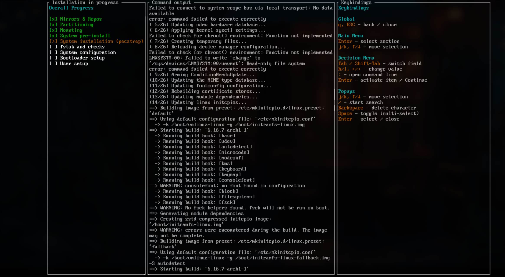

# 🦀 archinstall-rs

A modern, intuitive TUI (Terminal User Interface) installer for Arch Linux written in Rust. This project aims to simplify the Arch Linux installation process while maintaining the flexibility and control that Arch users expect.

## 📷 TUI Installer


## 📷 Install Process


> ⚠️ Still under Development.

### What works at the moment:
- 64bit system
- UEFI and BIOS systems
- Best-Effort Partitioning and Simple Manual Partitioning
- Only Grub and Systemd Bootloader
- NetworkManager and Copy ISO Network mode available
- Only Experience Mode "Desktop Environment" yet (due to NetworkManager)
- No Encryption yet
- No Custom Server/Repos yet
- No Unified Kernel Images (no Secure Boot)

> ⚠️ Logview Bug at the end of installation: Installation finishes successfully, Logview does not complete. Press Ctrl + C to exit and Reboot.

## 🚦 Roadmap

- [x] **v0.1.0** - MVP Installer
  - [x] TUI scaffolding and navigation
  - [x] Configuration save/load (TOML)
  - [x] Disk selection and partitioning plan preview (Info popup)
  - [x] Best-effort automatic partitioning (GPT, ESP/BIOS boot, 4GiB swap, btrfs root, optional LUKS)
  - [x] Partitioning execution via parted/mkfs/cryptsetup with safety checks
  - [x] Abort if target has mounted partitions
  - [x] Wipe confirmation if device appears already partitioned
  - [x] Dry-run mode shows full command plan without changes
  - [x] Mirror configuration (regions via reflector, custom servers, optional/custom repos persisted)
  - [x] Mount filesystems, enable swap, pacstrap base and selected packages
  - [x] Generate fstab
  - [x] Basic system configuration (locale, timezone, hostname, keymap)
  - [x] Enable networking/time sync (NetworkManager/systemd-timesyncd as selected)
  - [x] Root/user setup (passwords, sudoers, optional login manager)
  - [x] Bootloader setup: systemd-boot (UEFI) and GRUB (UEFI/BIOS)
  - [x] Installation progress view and log viewer
  - [x] Manual partitioning partially implemented. Simple partitioning possible.

- [ ] **v0.2.0** - Manual Partitioning & Boot Enhancements
  - [x] Custom mount points
  - [x] Help system with contextual information
  - [x] Installation progress visualization
  - [x] Profile system (Desktop, Server, Minimal)
  - [x] AUR helper integration
  - [x] Post-installation script support
  - [x] Configuration validation
  - [x] Log viewer

- [ ] **v0.3.0** - Advanced Disk & System Features
  - [ ] EFISTUB and Limine bootloaders
  - [ ] LVM support
  - [ ] RAID configuration
  - [ ] Unified Kernel Images generation
  - [ ] Multi-language UI support
  - [ ] Advanced partition editor

- [ ] **v0.4.0** - Advanced Features
  - [ ] Unattended installation mode
  - [ ] Network installation support
  - [ ] Configuration templates
  - [ ] Cloud-init support
  - [ ] Ansible playbook generation

- [ ] **v1.0.0** - Production Ready
  - [ ] Comprehensive testing suite
  - [ ] Complete documentation
  - [ ] Stable API
  - [ ] Official Arch Linux repository inclusion

## ✨ Features

- **🖥️ Modern TUI Interface**: Built with [ratatui](https://github.com/ratatui-org/ratatui), providing an intuitive and responsive terminal interface
- **⚡ Fast & Efficient**: Written in Rust for optimal performance and memory safety
- **🔧 Flexible Configuration**: Support for various installation scenarios and customization options
- **💾 Configuration Saving**: Save and load installation configurations in TOML format
- **🔐 Disk Encryption (experimental)**: LUKS groundwork present; passphrase handling WIP
- **🌍 Localization**: Comprehensive locale, timezone, and keyboard layout configuration
- **📦 Package Management**: Configure mirrors, optional repositories, and additional packages
- **👤 User Management**: Create users with sudo privileges and secure password handling
- **🔄 Multiple Bootloaders**: Support for systemd-boot, GRUB, and other bootloaders
- **🎵 Audio System Selection**: Choose between different audio subsystems
- **🔗 Network Configuration**: Configure network settings for your installation
- **⚙️ Kernel Selection**: Choose from various kernel options
- **💱 Swap Configuration**: Optional swap partition setup
- **🎨 Catppuccin Mocha Theme**: Consistent, readable palette across the TUI
- **🌈 Truecolor-ready**: Best visuals with `TERM=xterm-256color` and `COLORTERM=truecolor`
- **🌐 Copy ISO Network mode**: Replicates the Arch ISO network (systemd-networkd/resolved) to the target
- **📶 Desktop NM guard**: For KDE Plasma and GNOME, the installer prompts to switch to NetworkManager if not selected
- **🪟 Minimal GUI bootstrap (`boot.sh`)**: Optional helper that prepares a lightweight GUI (cage+foot) and logs progress

## 📋 Requirements

### Build Requirements
- Rust (edition 2024) on a recent stable toolchain (1.84+ recommended)
- Cargo package manager

### Runtime Requirements
- Arch Linux live environment (USB/ISO)
- UEFI or BIOS system
- Internet connection for package downloads
- Minimum 512MB RAM (1GB+ recommended)
- Minimum 2GB disk space (20GB+ recommended for comfortable usage)

## VM Setup

- Press 'e' in Boot-Menu and input the following:

```bash
linux /arch/boot/x86_64/vmlinuz-linux archisobasedir=arch cow_spacesize=8G
```

## 🚀 Installation

```bash
# (optional) Set keyboard layout, e.g. Swiss German
loadkeys de_CH-latin1
```

### Quickstart (recommended, ISO TTY)

```bash
# 1) Clone this repository (network required)
git clone https://github.com/Firstp1ck/archinstall-rs.git
cd archinstall-rs

# 2) Launch the installer helper
./boot.sh

# Notes:
# - The helper prepares a minimal GUI (Wayland cage + foot or Xorg + xterm), prints progress,
#   and logs to the path shown on start.
# - If the prebuilt binary is not present, boot.sh will download the latest release automatically.
# - If a GUI cannot be prepared, the helper exits with an error (no half-started state).

# Optional: Dry-run (no changes) with verbose logs
ARCHINSTALL_DRY_RUN_LOG=/tmp/ai-dry.log ./boot.sh INSTALLER_FLAGS="--dry-run --debug"
```

### From Source

```bash
# Install dependencies
pacman -Sy rustup git gcc base-devel
```

```bash
# Install rust
rustup install stable
```

```bash
# Clone the repository
git clone https://github.com/Firstp1ck/archinstall-rs.git
cd archinstall-rs

# Build the project
cargo build

# Run the installer
cargo run
```

### Pre-built Binary

```bash
# Download the latest release (if not already present)
wget https://github.com/Firstp1ck/archinstall-rs/releases/latest/download/archinstall-rs
chmod +x archinstall-rs

# Recommended from ISO TTY: use the helper to bootstrap a minimal GUI and run the installer
./boot.sh

# Dry-run preview from TTY (no changes), with verbose logging
ARCHINSTALL_DRY_RUN_LOG=/tmp/ai-dry.log ./boot.sh INSTALLER_FLAGS="--dry-run --debug"
```

## 🎮 Usage

### Basic Installation

1. Boot into Arch Linux live environment
2. Ensure you have an internet connection
3. Clone the repository.
4. cd into archinstall-rs
4. Start the installer from the Arch ISO TTY (recommended):
   ```bash
   ./boot.sh
   ```
   This helper prepares a tiny graphical session (Wayland cage + foot or Xorg + xterm), prints progress to the console, and logs to the path shown at start. If a GUI cannot be prepared, it exits with an error so nothing half-starts.
5. Navigate through the installation sections using arrow keys
6. Configure each section according to your preferences
7. Review your configuration
8. Start the installation

### Navigation

#### Global

| Key | Action |
|-----|--------|
| `↑/↓` or `k/j` | Navigate items (menu or content, based on focus) |
| `←/→` or `h/l` | Change value/selection in active decision |
| `Enter` | Select/Confirm/Run action |
| `Esc` or `q` | Close popup or return focus to menu (never quits) |
| `Ctrl-C` | Quit application |
| `Tab` / `Shift-Tab` | Next/Prev field (Locales screen) |
| `:` | Open command line (Locales screen) |

#### Popups

| Key | Action |
|-----|--------|
| `↑/↓` or `k/j` | Move selection |
| `←/→` or `h/l` | Change option/side |
| `Enter` | Confirm/Apply |
| `Esc` or `q` | Close popup |
| `Space` | Toggle checkbox/selection (if supported) |
| `/` | Start search filter; type to filter, `Backspace` to edit |

#### Additional Packages

| Key | Action |
|-----|--------|
| `↑/↓` | Move in package list |
| `j/k` | Switch between action buttons (Add/Continue) |
| `Space` | Toggle selection on the current package |
| `Backspace`/`Delete` | Remove current or all checked packages |

#### Command-line mode (Locales)

| Key | Action |
|-----|--------|
| `:` | Open command-line while editing Locales |
| `Esc` | Exit command-line |
| `Enter` | Execute current command |

| Command | Effect |
|---------|--------|
| `w` | Apply changes |
| `wq` | Apply changes and return to menu |
| `q` | Discard changes and return to menu |
| any other text | Close without action |

#### Reboot Prompt (after successful install)

| Key | Action |
|-----|--------|
| `Y` / `y` / `J` / `j` / `Enter` | Reboot now |
| `N` / `n` / `Esc` | Cancel reboot |

### Optional: Launch with a Minimal GUI

If you’re on a bare TTY, use the included helper which prepares a tiny graphical session and prints progress:

```bash
./boot.sh
```

It logs to the path printed on start and exits with an error if a GUI cannot be prepared.

### Configuration Sections

#### 1. **Locales**
- Keyboard layout selection
- System language configuration  
- Character encoding settings

#### 2. **Mirrors & Repositories**
- Mirror region selection
- Optional repository configuration (multilib, testing, etc.)
- Custom repository management
- Custom mirror server configuration

#### 3. **Disks**
- Automatic partitioning with best-effort layout
- Manual partition selection
- File system configuration

#### 4. **Disk Encryption**
- Experimental LUKS support (non-interactive passphrase pipeline is WIP)
- Password-based encryption
- Partition-specific encryption

#### 5. **Swap Partition**
- Enable/disable swap
- Automatic swap size calculation
- Custom swap configuration

#### 6. **Bootloader**
- systemd-boot (recommended for UEFI)
- GRUB (UEFI/BIOS support)
- Other bootloader options

#### 7. **Unified Kernel Images**
- Configure unified kernel image generation
- Secure boot preparation

#### 8. **System Configuration**
- Hostname configuration
- Root password setup
- User account creation
- Sudo privileges management

#### 9. **Experience Mode**
- Desktop environment selection
- Display manager configuration
- Basic package sets

#### 10. **Audio**
- PulseAudio
- PipeWire
- ALSA only
- No audio

#### 11. **Kernels**
- linux (stable)
- linux-lts (long-term support)
- linux-hardened (security-focused)
- linux-zen (performance-focused)

#### 12. **Network Configuration**
- NetworkManager (required for KDE Plasma and GNOME; the installer will prompt to switch)
- Copy ISO network configuration (systemd-networkd & systemd-resolved from the live ISO)
- Manual configuration

#### 13. **Additional Packages**
- Custom package installation
- AUR helper installation

#### 14. **Timezone & Time Sync**
- Timezone selection
- NTP configuration

## ⚙️ Configuration File

The installer supports saving and loading configurations in TOML format. This allows for:
- Reproducible installations
- Configuration sharing
- Automated deployments

### Example Configuration

```toml
[users]

users = []
additional_packages = []

[locales]
keyboard_layout = "us"
locale_language = "en_US.UTF-8"
locale_encoding = "UTF-8"

[mirrors]
regions = ["United States"]
optional_repos = ["multilib"]
custom_servers = []
custom_repos = []

[disks]
mode = "Best-effort partition layout"

[disk_encryption]
encryption_type = "None"

[swap]
enabled = true

[bootloader]
kind = "systemd-boot"

[system]
hostname = "archlinux"
root_password_hash = "" # optional, SHA256 hex
automatic_time_sync = true
timezone = "Europe/London"

[experience]
mode = "Desktop"
desktop_envs = ["KDE Plasma"]
# login_manager = "sddm"
# login_manager_user_set = false

[audio]
kind = "pipewire"

[kernels]
selected = ["linux", "linux-lts"]

[network]
mode = "NetworkManager"

[unified_kernel_images]
enabled = false

# Optional: define users
[[users]]
username = "myuser"
password_hash = "..." # SHA256 hex
is_sudo = true

# Optional: additional packages
#[[additional_packages]]
#repo = "extra"
#name = "firefox"
#version = ""
#description = "Web browser"
```

### Loading a Configuration (planned)

The CLI flag `--config` is not implemented yet. Configuration save/load works inside the TUI, and CLI loading will be added in a future release.

## 🏗️ Project Structure

```
archinstall-rs/
├── src/
│   ├── main.rs                     # Entry point
│   ├── lib.rs
│   ├── runner.rs                   # TUI run loop and helpers
│   ├── app/                        # Installation sections and install flow
│   │   ├── install/                # Flow builder and UI for install
│   │   ├── config/                 # TOML save/load/types and summary view
│   │   └── *.rs                    # Screens (disks, bootloader, etc.)
│   ├── common/                     # Shared UI utilities and popups
│   ├── core/                       # Core plumbing and services
│   │   ├── services/               # partitioning, mounting, bootloader, ...
│   │   └── state.rs                # Global app state
│   ├── input/                      # Input handling (screens, popups, cmdline)
│   └── render/                     # Rendering (sections, popups, theme)
├── assets/
│   └── limine/                     # Limine assets (experimental)
├── boot.sh                         # Minimal GUI bootstrap helper
├── run-tui.sh                      # Wrapper to launch prebuilt binary in a terminal
├── archinstall-rs.config.toml      # Example configuration
├── Cargo.toml
└── README.md
```

## 🔧 Development

### Building from Source

```bash
# Debug build (faster compilation)
cargo build

# Run with debug build
cargo run

# Check for compilation errors
cargo check

# Run tests
cargo test

# Format code
cargo fmt

# Lint code
cargo clippy
```

### Architecture Principles

- **Modularity**: Each installation section is a separate module
- **Separation of Concerns**: UI, logic, and data are clearly separated
- **Type Safety**: Leverage Rust's type system for reliability
- **Error Handling**: Graceful error handling with user-friendly messages

### Adding New Features

1. Define the screen
   - Add a new variant to `Screen` in `src/core/types.rs` (e.g., `Screen::MyFeature`).
   - If you need a popup, add a `PopupKind::MyFeature...` variant here as well.

2. Register it in the menu and state
   - In `src/core/state.rs`, add a `MenuEntry { label, content, screen: Screen::MyFeature }` in `AppState::new()` so it appears in the left menu.
   - Add any per-screen state fields to `AppState` (focus indices, selections, buffers, etc.).

3. Implement the screen renderer
   - Create `src/app/my_feature.rs` with `pub fn draw_my_feature(frame: &mut Frame, app: &mut AppState, area: Rect)`.
   - Wire it in `src/render/sections/content.rs` by adding a `match` arm for `Screen::MyFeature` that calls `app::my_feature::draw_my_feature(...)`.
   - If you want Info-box content, extend `src/render/sections/info.rs` to show a summary when `Screen::MyFeature` is active.

4. Handle input for the screen
   - Create `src/input/screens/my_feature.rs` implementing handlers like `move_my_feature_up/down`, `change_my_feature_value`, `handle_enter_my_feature`.
   - Export the module in `src/input/screens/mod.rs` and wire the handlers in `src/input/screens/dispatcher.rs` inside `move_screen_up/down`, `change_value`, and `handle_enter` for `Screen::MyFeature`.

5. Add popup plumbing (optional)
   - Add `open_...` helpers or extend existing ones in `src/common/popups.rs` if your screen opens popups.
   - Update `apply_popup_selection` in `src/common/popups.rs` to apply the selection to your screen state.
   - Reuse a generic popup renderer (`src/render/popup/general.rs`) or add a custom one under `src/render/popup/` if needed.

6. Persist configuration (optional)
   - Add fields to the config schema in `src/app/config/types.rs` and surface them in `src/app/config/view.rs` if you want them shown in the summary.
   - Read/write them in `src/app/config/io.rs` so they are saved/loaded from the TOML config.

7. Participate in the install flow (optional)
   - If your feature requires system actions, add a service in `src/core/services/` and return command steps.
   - Append your service commands in `src/app/install/flow.rs` inside `build_install_plan` at the appropriate stage.

8. Finalize
   - Add tests and documentation as needed.

## 🤝 Contributing

Contributions are welcome! Please feel free to submit a Pull Request. For major changes, please open an issue first to discuss what you would like to change.

### Guidelines

1. Follow Rust best practices and idioms
2. Maintain the existing code style
3. Add tests for new functionality
4. Update documentation as needed
5. Keep commits atomic and well-described
6. Ensure all tests pass before submitting PR

### Development Setup

```bash
# Fork and clone the repository
git clone https://github.com/Firstp1ck/archinstall-rs.git
cd archinstall-rs

# Create a new branch for your feature
git checkout -b feature/your-feature-name

# Make your changes
# ...

# Run tests and checks
cargo test
cargo fmt --check
cargo clippy

# Commit and push
git add .
git commit -m "feat: add your feature"
git push origin feature/your-feature-name

# Open a Pull Request on GitHub
```

## 🐛 Bug Reports

If you find a bug, please open an issue with:
- Clear description of the problem
- Steps to reproduce
- Expected behavior
- Actual behavior
- System information (Arch version, hardware, etc.)
- Relevant configuration files
- Error messages or logs

## 📜 License

This project is licensed under the MIT License - see the [LICENSE](LICENSE) file for details.

## 🙏 Acknowledgments

- The Arch Linux community for their excellent documentation
- The [ratatui](https://github.com/ratatui-org/ratatui) team for the amazing TUI framework
- The original [archinstall](https://github.com/archlinux/archinstall) Python project for inspiration
- All contributors who help improve this project

## 📞 Contact

- GitHub Issues: [Report bugs or request features](https://github.com/Firstp1ck/archinstall-rs/issues)
- Discussions: [Join the conversation](https://github.com/Firstp1ck/archinstall-rs/discussions)

## ⚠️ Disclaimer

This installer modifies disk partitions and system configurations. Always backup important data before using. The developers are not responsible for any data loss or system damage that may occur.

---

**Made with ❤️ and 🦀 for the Arch Linux community**