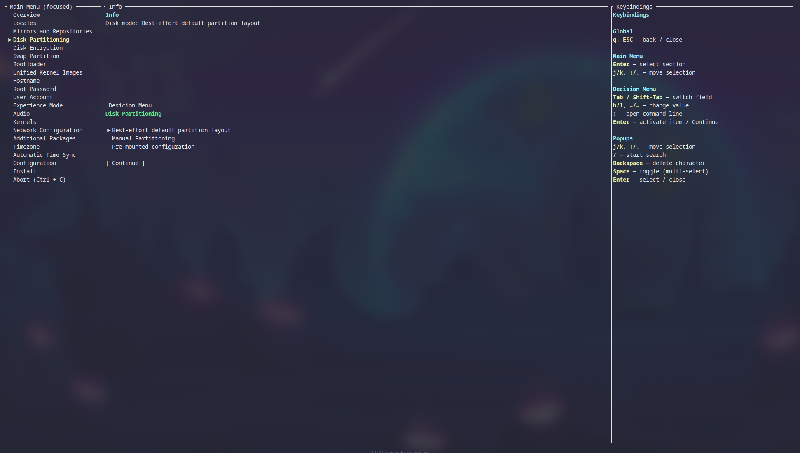
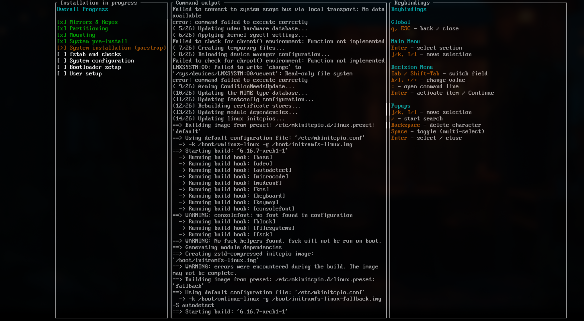

# archinstall-rs

[](LICENSE)
[](https://www.rust-lang.org/)
[](https://archlinux.org/)

Terminal (TUI) installer for Arch Linux written in Rust: guided steps, saved TOML configs, partitioning and boot loader setup, and a clear install plan (including dry-run).

## Community

<p align="center">
  Questions or bugs? <strong><a href="https://github.com/Firstp1ck/archinstall-rs/issues">Open an issue</a></strong> or join <strong><a href="https://github.com/Firstp1ck/archinstall-rs/discussions">Discussions</a></strong>.
</p>

## Table of contents

- [Quick start](#quick-start)
- [Screenshots](#screenshots)
- [Features](#features)
- [Documentation](#documentation)
- [Contributing](#contributing)
- [License](#license)

## Quick start

On the **Arch live ISO** with networking:

```bash
curl -fsSL https://github.com/Firstp1ck/archinstall-rs/releases/latest/download/install.sh | bash
```

Pass flags through to the installer:

```bash
curl -fsSL https://github.com/Firstp1ck/archinstall-rs/releases/latest/download/install.sh | bash -s -- --help
```

Pin a release by swapping `latest` for a tag path (for example `releases/download/vX.X.X/install.sh`).

Full install paths (clone + `boot.sh`, build from source, VM tips): [Documents/INSTALL.md](Documents/INSTALL.md).

## Screenshots

### TUI



### Install process



## Features

High level: ratatui-based UI, Rust codebase, disk planning with validated mounts/fstab, TOML save/load, optional LUKS on automatic layouts (experimental), locales and mirrors, NetworkManager or “copy ISO network”, systemd-boot, GRUB, **Efistub (experimental, UEFI-only)**, Limine, desktop-oriented experience mode, optional `boot.sh` GUI bootstrap.

Details: [Documents/FEATURES.md](Documents/FEATURES.md).

## Documentation

| Topic | Location |
|--------|-----------|
| Install, requirements, source build, VM kernel line | [Documents/INSTALL.md](Documents/INSTALL.md) |
| Current limitations and known issues | [Documents/STATUS.md](Documents/STATUS.md) |
| Using the TUI (flow, keybindings, sections) | [Documents/USAGE.md](Documents/USAGE.md) |
| TOML configuration | [Documents/CONFIGURATION.md](Documents/CONFIGURATION.md) |
| Layout, build commands, feature checklist | [Documents/DEVELOPMENT.md](Documents/DEVELOPMENT.md) |
| Roadmap | [Documents/ROADMAP.md](Documents/ROADMAP.md) |
| Troubleshooting and bug reports | [Documents/TROUBLESHOOTING.md](Documents/TROUBLESHOOTING.md) |
| Releases (notes) | [Documents/](Documents/) (`RELEASE_*.md`, `release_v*.md`) |
| Manual / reference | [Documents/arch_manual.md](Documents/arch_manual.md) |

## Contributing

See [CONTRIBUTING.md](CONTRIBUTING.md).

## Acknowledgments

- Arch Linux documentation and community
- [ratatui](https://github.com/ratatui-org/ratatui)
- [archinstall](https://github.com/archlinux/archinstall) (Python) for inspiration
- Contributors

## Disclaimer

This tool can repartition disks and change system configuration. Back up important data. Authors are not responsible for data loss or broken systems.

## License

MIT — see [LICENSE](LICENSE).
